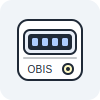

# Homebridge OBIS Powermeter 

A Homebridge plugin to read OBIS smart meter values.



Read values from SML/D0 OBIS smart meters and expose them to HomeKit as simple sensors, like ZPA, Landis+Gyr, Elster, Itron, and others.


- Power Consumption: net import power (W)
- Power Return (optional): export power (W). Hidden by default.
- Voltage L1/L2/L3: per‑phase voltages (V)
- Energy Import (Total, kWh): cumulative imported energy

Tested with ZPA power meter. Feedback for other models (Landis+Gyr, Elster, Itron, …) is welcome.
D0 should theoretically work, but is currently untested — please report issues if you try it.

## Requirements
- Node.js >= 20
- Homebridge >= 1.8
- A supported SML/D0 interface on your meter (e.g. IR head via USB)

## Install
```bash
npm i -g homebridge-obis-powermeter
```

## Configure
Use Homebridge UI (recommended) or edit config.json. Platform name is SML.

Minimal example:
```json
{
  "platform": "SML",
  "serialPort": "/dev/ttyUSB0"
}
```

Full example with options:
```json
{
  "platform": "SML",
  "serialPort": "/dev/ttyUSB0",
  "protocol": "SmlProtocol",
  "serialBaudRate": 9600,
  "serialDataBits": 8,
  "serialStopBits": 1,
  "serialParity": "none",
  "pollInterval": 60,
  "hidePowerConsumptionDevice": false,
  "hidePowerReturnDevice": true,
  "debugLevel": 0
}
```
Notes:
- Power Return is hidden by default. Set hidePowerReturnDevice to false to show it.
- Voltage sensors (L1/L2/L3) are always enabled.
- protocol can be SmlProtocol (default) or D0Protocol.
- You can also set OBIS_DEBUG=0|1|2 in the child bridge environment for extra logs.

## What values are shown?
The plugin computes net active power (in watts) from your meter and feeds it to both accessories. Power Consumption displays it when > 0 (import). Power Return displays the absolute value when net < 0 (export).

Priority of OBIS sources (first available wins):
1) 1-0:16.7.0 (or 1-0:16.7.0*255) — total instantaneous active power
2) 1-0:1.7.0 (import) minus 1-0:2.7.0 (export)
3) Sum of per-phase import (21.7.0/41.7.0/61.7.0) minus export (22.7.0/42.7.0/62.7.0)
4) Sum of 36.7.0/56.7.0/76.7.0 as a fallback

Voltage sensors map directly to:
- L1: 1-0:32.7.0*255
- L2: 1-0:52.7.0*255
- L3: 1-0:72.7.0*255

Energy totals map directly to:
- Import total (kWh): 1-0:1.8.0*255 (fallback 1-0:1.8.0)

Units: kW -> W for power, kV -> V for voltage, Wh -> kWh for energy if needed; otherwise values are used as-is.

HomeKit service used: CurrentAmbientLightLevel (Light Sensor). Values are always >= 0.0001 as required by HomeKit. Accessories are categorized as SENSOR to avoid bulb icons in some clients.

### Display precision (Home app)
Apple’s Home app heavily rounds Light Sensor values at higher magnitudes. For example, 11165.0976 kWh may display as 11200. The precise value is still written to the characteristic. To see exact values, use apps like Eve or Home+ that show raw characteristic readings.

## Troubleshooting
- Serial device not found: verify the serialPort path (prefer /dev/serial/by-id on Linux) and permissions.
- No readings / timeouts: confirm protocol matches your meter; try increasing pollInterval; check logs.
- D0 meters: you may need different baud rate/parity according to your device.
- Debugging: set debugLevel to 1 or 2 or use OBIS_DEBUG env var on the child bridge.
- Icon looks wrong: remove cached accessories in Homebridge UI and restart Homebridge.

## Development
- Build: `npm run build`
- Watch & link for Homebridge dev: `npm run watch`
- Tests: `npm test`

Project structure:
- src/Platform.ts — platform and meter reading
- src/Accessories/PowerConsumption.ts — consumption accessory
- src/Accessories/PowerReturn.ts — export accessory (optional)
- src/Accessories/VoltageSensor.ts — per-phase voltage accessories
- src/Accessories/EnergyImport.ts — total energy import (kWh)

## Roadmap
- [ ] Get certified by Homebridge team
- [ ] Support D0 protocol (untested)
- [ ] Add more OBIS sources if needed
- [ ] Improve error handling and logging
- [ ] Support for other transports if needed (TCP/IP, LocalFile, StdIn)
- [ ] Support of JsonEfrProtocol for EFR Smart Grid Hub (JSON)
- [ ] Multiple meters (e.g. multiple serial ports)

## License
Apache-2.0
